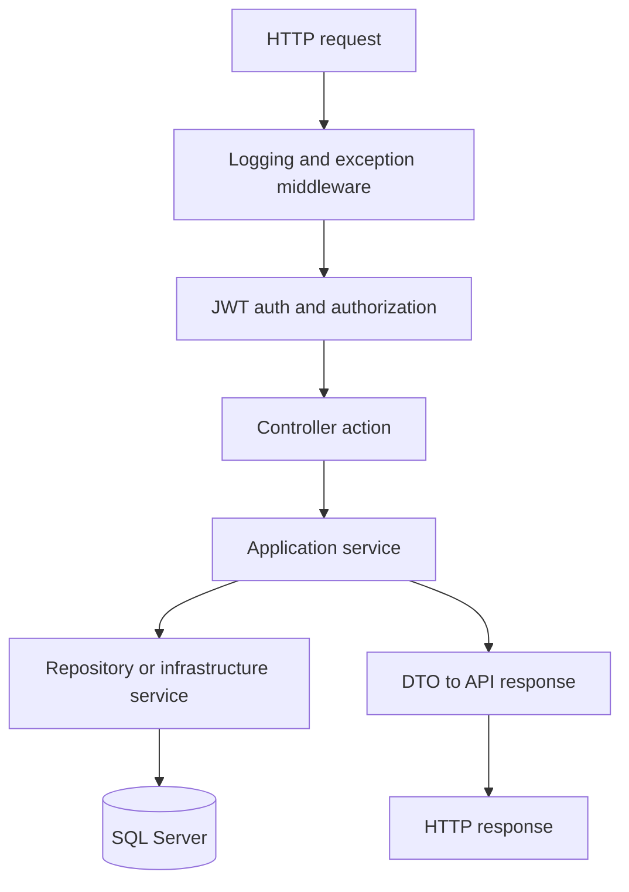
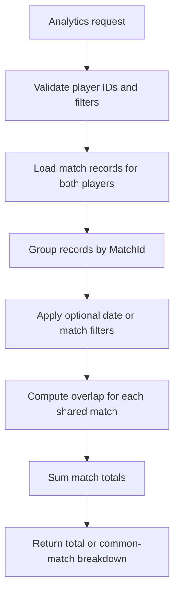

# FootballPairs API

FootballPairs is a .NET 8 backend API for managing football teams, players, matches, player participation intervals, CSV imports, and player-pair analytics. The project is built as a layered solution with strict validation rules, JWT authentication, and database-backed safeguards for the most important integrity constraints.

## Table of Contents

- [What This Project Is](#what-this-project-is)
- [Project Understanding](#project-understanding)
- [Core Features](#core-features)
- [Architecture](#architecture)
- [How the Main Algorithm Works](#how-the-main-algorithm-works)
- [Tech Stack](#tech-stack)
- [Repository Structure](#repository-structure)
- [Getting Started](#getting-started)
- [Configuration](#configuration)
- [Authentication and Authorization](#authentication-and-authorization)
- [API Summary](#api-summary)
- [CSV Import Rules](#csv-import-rules)
- [Data Integrity Rules](#data-integrity-rules)
- [Documentation Map](#documentation-map)
- [Troubleshooting](#troubleshooting)
- [Notes](#notes)

## What This Project Is

This project solves a specific football data problem: storing match participation data in a way that stays valid enough to support reliable pair analytics.

The API is not just a CRUD service. It is designed to protect the meaning of the data:

- teams and players must exist before they are referenced
- a team cannot appear in multiple matches on the same calendar date
- a player cannot have multiple match records for the same match
- interval data must remain valid for overlap-based analytics
- imports must be atomic and safe

That is why the project combines application-layer validation with database-level constraints and triggers.

## Project Understanding

My understanding of the system is:

- `FootballPairs.Api` is the HTTP boundary. It owns controllers, auth setup, middleware, and configuration.
- `FootballPairs.Application` is the business layer. It contains the real rules for auth, CRUD, imports, and analytics.
- `FootballPairs.Domain` holds the core entities and domain constants.
- `FootballPairs.Infrastructure` implements EF Core persistence, migrations, token generation, CSV parsing, logging sinks, and SQL triggers.

In practical terms, the project behaves like this:

1. A client authenticates and receives a JWT.
2. An admin creates or imports teams, players, matches, and match records.
3. The application validates that the data is structurally correct and logically consistent.
4. The analytics endpoints use the stored match records to compute how long two players were on the pitch together.

This makes the analytics feature the center of the project. Most of the validation rules exist to ensure those calculations remain trustworthy.

## Core Features

- JWT registration, login, logout, identity inspection, and admin guard check
- CRUD for teams, players, matches, and match records
- CSV imports for teams, players, matches, and match records
- Pair analytics:
  - total played time together
  - total played time together for a specific match
  - common-match breakdown with totals
- Consistent `application/problem+json` error responses
- Database request logging with file fallback when DB logging is unavailable

## Architecture

The solution follows a layered architecture:

- `FootballPairs.Api`
  - controllers
  - request/response contracts
  - auth configuration
  - exception handling middleware
  - request logging middleware
- `FootballPairs.Application`
  - use-case services
  - validation rules
  - DTOs and commands
  - analytics logic
  - import orchestration
- `FootballPairs.Domain`
  - entities
  - shared domain limits
- `FootballPairs.Infrastructure`
  - EF Core DbContext
  - repository implementations
  - migrations
  - CSV support
  - JWT/token services
  - logging sinks
  - SQL triggers

### Request Flow



## How the Main Algorithm Works

The main concept in this project is "played time together". The API answers this question:

How many minutes were Player A and Player B on the field at the same time?

### The Input Model

The algorithm works from `MatchRecords`.

A match record is one interval:

- `MatchId`
- `PlayerId`
- `FromMinute`
- `ToMinute`

If `ToMinute` is `null`, the code treats it as the match end minute, which is usually `90`.

### The Core Idea

For each match where both players have records:

1. Load all records for Player A.
2. Load all records for Player B.
3. Compare every A interval against every B interval.
4. Compute the overlap for each pair.
5. Add all positive overlaps.

The overlap formula is:

```text
overlap = max(0, min(endA, endB) - max(startA, startB))
```

That means:

- take the later start
- take the earlier end
- subtract them
- if the result is negative, treat it as zero

### Why Half-Open Intervals Matter

The project uses half-open interval logic: `[start, end)`.

That means:

- minute `start` is included
- minute `end` is excluded

This avoids double counting at boundaries.

Example:

- Player A: `[0, 45)`
- Player B: `[45, 90)`

These intervals touch, but they do not overlap. The result is `0`.

### Worked Example

Suppose one match has:

- Player A: `[0, 30)` and `[40, 90)`
- Player B: `[10, 50)`

Comparison:

- `[0, 30)` with `[10, 50)` gives `20`
- `[40, 90)` with `[10, 50)` gives `10`

Total for the match: `30`

### How the Service Uses It



### Why the Validation Rules Exist

The analytics only make sense if the underlying intervals are valid. That is why the rest of the project enforces:

- one match record per `(MatchId, PlayerId)`
- non-negative minute values
- `FromMinute < ToMinute`
- `ToMinute <= EndMinute`
- player must belong to one of the teams in the match
- no overlapping intervals at the database level for the same player and match

Without those rules, the algorithm could overcount or produce contradictory results.

## Tech Stack

- .NET 8 (`net8.0`)
- ASP.NET Core Web API
- Entity Framework Core 8
- SQL Server / LocalDB
- JWT Bearer authentication
- Custom CSV parser

## Repository Structure

```text
.
|- FootballPairs.Api
|- FootballPairs.Application
|- FootballPairs.Domain
|- FootballPairs.Infrastructure
|- docs
|  `- postman
|- samples
|- LocalDB
`- logs
```

## Getting Started

### Prerequisites

- .NET 8 SDK
- SQL Server LocalDB or SQL Server
- `dotnet-ef` CLI tool

Install EF CLI if needed:

```powershell
dotnet tool install --global dotnet-ef
```

### Restore and build

```powershell
dotnet restore
dotnet build FootballPairs.sln
```

### Start LocalDB if needed

```powershell
sqllocaldb create MSSQLLocalDB
sqllocaldb start MSSQLLocalDB
```

### Apply migrations

```powershell
dotnet ef database update -p FootballPairs.Infrastructure -s FootballPairs.Api
```

### Run the API

```powershell
dotnet run --project FootballPairs.Api/FootballPairs.Api.csproj
```

Local launch settings include:

- `https://localhost:7182`
- `http://localhost:5140`

## Configuration

Main settings are in `FootballPairs.Api/appsettings.json`.

| Key | Purpose |
| --- | --- |
| `ConnectionStrings:DefaultConnection` | SQL Server connection string |
| `Jwt:Key` | JWT signing key |
| `Jwt:Issuer` | JWT issuer |
| `Jwt:Audience` | JWT audience |
| `Jwt:UsernameClaimType` | name claim mapping |
| `Jwt:RoleClaimType` | role claim mapping |
| `ImportPaths:AllowedRoots` | allowed roots for path-based CSV import |

Important:

- `Jwt:Key` must exist or startup fails.
- The checked-in JWT key is for development only.
- CORS is currently configured as allow-all in code.

## Authentication and Authorization

- Public:
  - `POST /api/auth/register`
  - `POST /api/auth/login`
- Authenticated:
  - all read endpoints
  - analytics endpoints
  - `POST /api/auth/logout`
  - `GET /api/auth/me`
- Admin only:
  - all create, update, delete endpoints
  - all import endpoints
  - `GET /api/auth/admin-check`

Role rule:

- first registered user becomes `admin`
- later users become `user`

## API Summary

### Auth

- `POST /api/auth/register`
- `POST /api/auth/login`
- `POST /api/auth/logout`
- `GET /api/auth/me`
- `GET /api/auth/admin-check`

### Teams

- `POST /api/teams`
- `GET /api/teams`
- `GET /api/teams/{id}`
- `PUT /api/teams/{id}`
- `DELETE /api/teams/{id}`

### Players

- `POST /api/players`
- `GET /api/players`
- `GET /api/players/{id}`
- `PUT /api/players/{id}`
- `DELETE /api/players/{id}`

### Matches

- `POST /api/matches`
- `GET /api/matches`
- `GET /api/matches/{id}`
- `PUT /api/matches/{id}`
- `DELETE /api/matches/{id}`

### Match Records

- `POST /api/match-records`
- `GET /api/match-records`
- `GET /api/match-records/{id}`
- `PUT /api/match-records/{id}`
- `DELETE /api/match-records/{id}`

### Imports

- `POST /api/import/teams`
- `POST /api/import/players`
- `POST /api/import/matches`
- `POST /api/import/match-records`

### Analytics

- `GET /api/analytics/players/{playerAId}/with/{playerBId}/played-time`
- `GET /api/analytics/players/{playerAId}/with/{playerBId}/common-matches`

For request and response details, use [docs/api-contracts.md](./docs/api-contracts.md).

## CSV Import Rules

Imports use `multipart/form-data` with exactly one source:

- `file`
- `path`

Rules:

- only one source is allowed
- max size is `100MB`
- path mode must stay under configured allowed roots
- reparse-point traversal is rejected
- import is transactional at the file level

Sample files:

- `samples/teams.csv`
- `samples/players.csv`
- `samples/matches.csv`
- `samples/records.csv`

## Data Integrity Rules

These rules are the backbone of the project:

- a team can participate in only one match per calendar date
- a player can have only one match record per match
- overlapping intervals for the same player and match are blocked
- a match record player must belong to one of the match teams
- `ToMinute = null` means match end
- score values must follow supported score formats

## Documentation Map

- [Documentation Index](./docs/index.md)
- [Project Overview](./docs/project-overview.md)
- [Architecture](./docs/architecture.md)
- [Development Guide](./docs/development-guide.md)
- [API Contracts](./docs/api-contracts.md)
- [Data Models](./docs/data-models.md)
- [Source Tree Analysis](./docs/source-tree-analysis.md)
- [Postman Quick Guide](./docs/postman/README.md)

## Troubleshooting

### Startup fails because JWT key is missing

Make sure `Jwt:Key` is configured in `appsettings.json`, environment variables, or user secrets.

### Authentication fails after logout

That is expected. Logout revokes the token by `jti`. Log in again to receive a fresh token.

### Match-record inserts fail

Check:

- the player belongs to one of the match teams
- minute boundaries are valid
- no duplicate `(MatchId, PlayerId)` record exists
- the DB trigger is not rejecting an overlap

### Migration fails on unique match-record rule

The database likely already contains duplicate `(MatchId, PlayerId)` rows. Clean the duplicates and rerun the migration.

## Notes

- No automated test project is currently included.
- Verification is mainly manual through build, migrations, and Postman.
- Swagger/OpenAPI is intentionally not exposed.
- The hardcoded JWT key should not be used in production.
