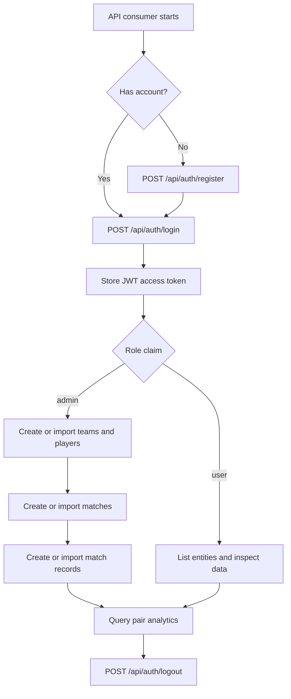

# FootballPairs Project Overview

## Purpose

FootballPairs is a .NET 8 backend API for managing football teams, players, matches, match participation intervals, CSV imports, and pair analytics. The main product value is strict data integrity: the API blocks invalid match schedules, duplicate match records for the same player, and unsafe import paths while keeping authentication and error handling consistent.

## Repository Classification

- Repository type: monolith
- Project type: backend
- Runtime entry point: `FootballPairs.Api/Program.cs`
- Solution layout: layered multi-project .NET solution

The repository contains four runtime projects:

- `FootballPairs.Api` exposes the HTTP API and middleware pipeline.
- `FootballPairs.Application` contains use-case orchestration and validation.
- `FootballPairs.Domain` contains entities and shared domain constants.
- `FootballPairs.Infrastructure` implements persistence, security, CSV parsing, logging, and SQL artifacts.

## Capability Summary

- JWT registration, login, logout, identity inspection, and admin guard checks
- CRUD for teams, players, matches, and match records
- CSV imports for all major entities with transactional behavior per file
- Analytics for total played time together and common match breakdowns
- Consistent `application/problem+json` error responses
- Database-backed request logging with local file fallback

## Tech Stack

| Category | Technology | Notes |
| --- | --- | --- |
| Language | C# | `net8.0` across all projects |
| API framework | ASP.NET Core Web API | Controller-based, no Swagger/OpenAPI surface |
| Persistence | Entity Framework Core 8.0.24 | SQL Server provider |
| Database | SQL Server / LocalDB | Default connection targets `MSSQLLocalDB` |
| Auth | JWT Bearer | Role-based authorization with token revocation |
| Imports | Custom CSV parser | No third-party CSV library |
| Logging | Database primary, file fallback | Sanitized payload logging plus failure audit files |

## Typical User Workflow

The API supports both admin operators and authenticated read-only users. A typical end-to-end workflow looks like this:

## Architectural Snapshot

- The API layer maps HTTP requests into application commands and DTOs.
- The application layer enforces business rules such as unique match records, per-date team scheduling, import validation, and analytics input checks.
- The infrastructure layer persists data with EF Core and SQL Server, handles token revocation storage, sanitizes logs, and writes fallback request logs when the database is unavailable.
- The domain layer keeps the core entities framework-agnostic.

## Main Constraints and Guards

- The first registered user becomes `admin`; later users become `user`.
- All endpoints except register and login require authentication.
- Admin privileges are required for create, update, delete, and import operations.
- A team can participate in only one match per calendar date.
- A player can have only one match record per match.
- `ToMinute = null` means the player stayed until match end.
- Import path mode is restricted to configured allowed roots and rejects reparse-point traversal.

## Documentation Map

- [Architecture](./architecture.md)
- [API Contracts](./api-contracts.md)
- [Data Models](./data-models.md)
- [Development Guide](./development-guide.md)
- [Source Tree Analysis](./source-tree-analysis.md)

## Existing Project Docs Worth Reading

- [Root README](../README.md)
- [Detailed Explanation](../EXPLANATION.md)
- [Postman Quick Guide](./postman/README.md)
- [Postman Collection](./postman/FootballPairs.postman_collection.json)
